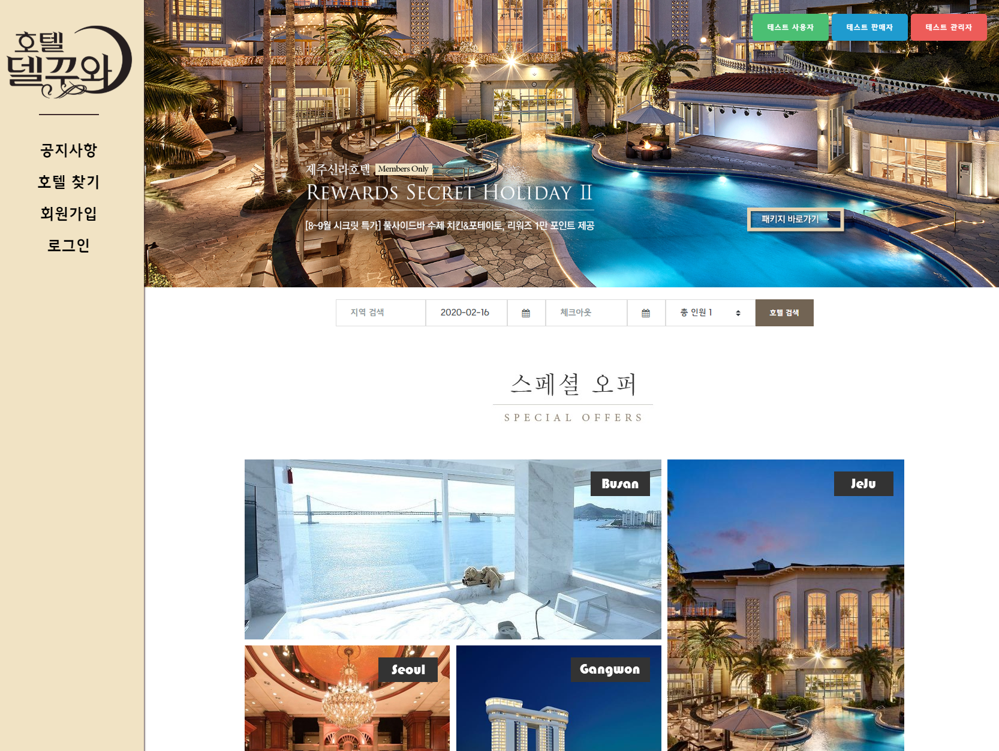
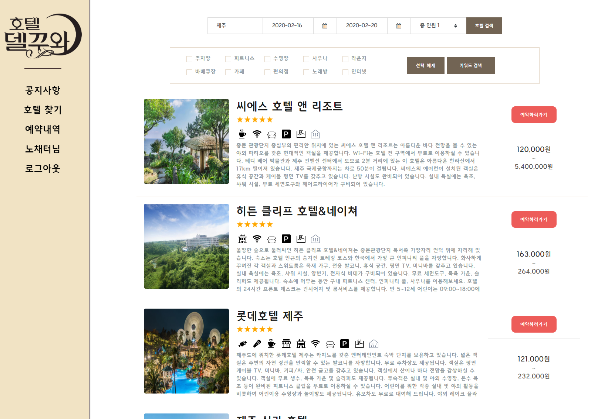
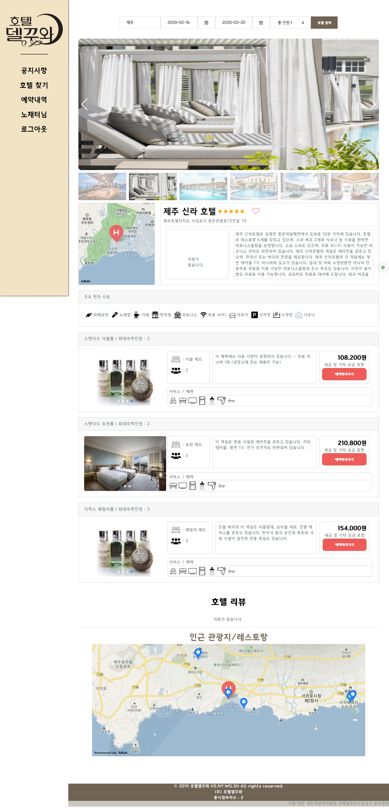
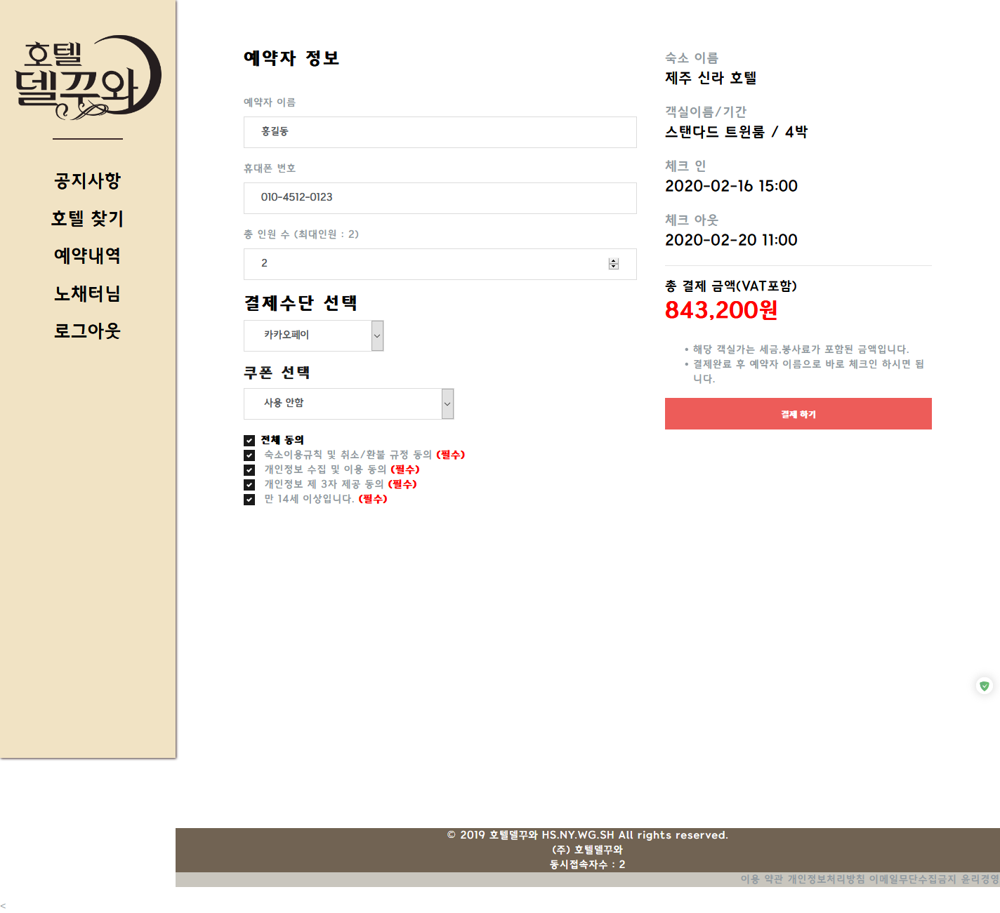
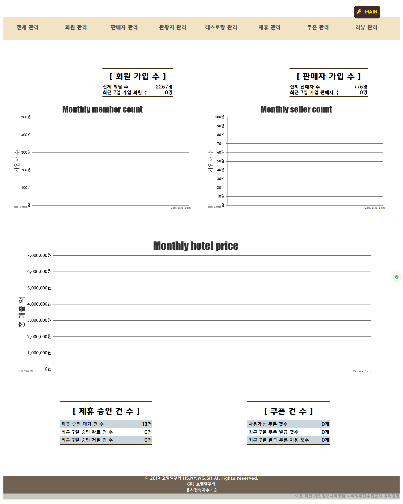
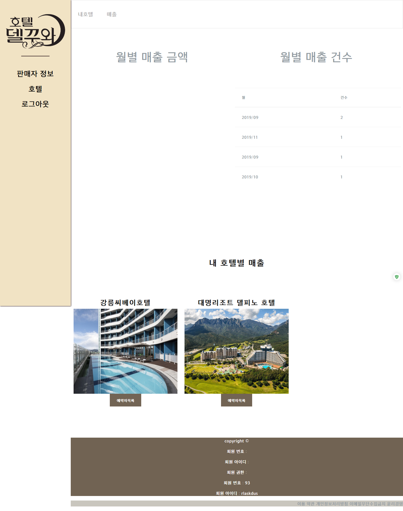

호텔 델꾸와
===========================
팀원 : 김현술, 김나연, 김소현, 정우근
-----------------------------------
호텔 예약 서비스를 주제로 제작한 홈페이지
-----------------------------------
JAVA Spring
Oracle

`김현술 : UI 설계 && 개발, ERD && DB 구축, 서비스 배포,  호텔 예약 및 예약가능 객실조회 && 상세페이지 && 예약 신청 및 결제 서비스`

`김나연 : 관리자 기능(회원 및 호텔 매니저 관리, 주변 관광지 및 레스토랑 첨삭, 호텔매니저 제휴 관리, 공지사항 및 쿠폰 관리)`

`김소현 : 회원 계정 관리(회원 가입 및 정보수정, 예약관리 및 리뷰 관리 && 쿠폰 수령)`

`정우근 : 호텔 매니저 계정 관리(사업자로 가입 & 정보수정, 호텔 추가 및 관리, 호텔 매출 내역 확인 제휴 신청)`

